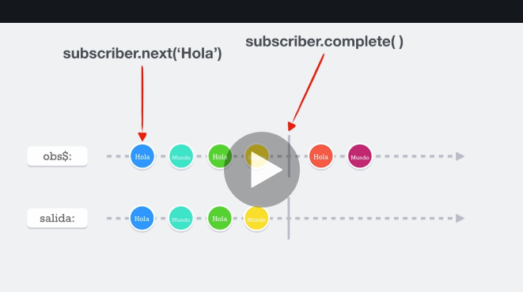
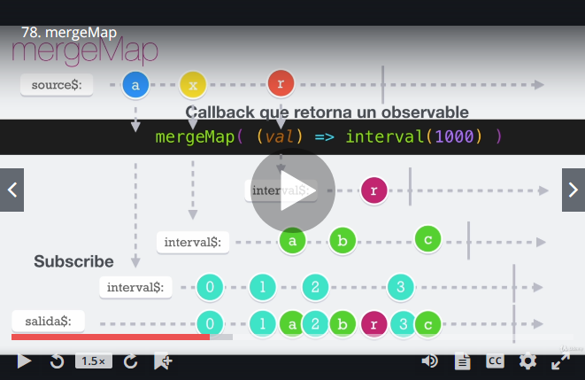
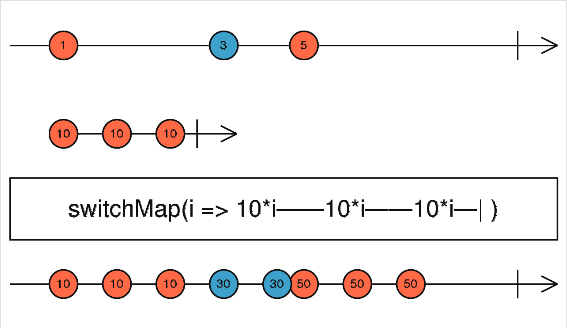
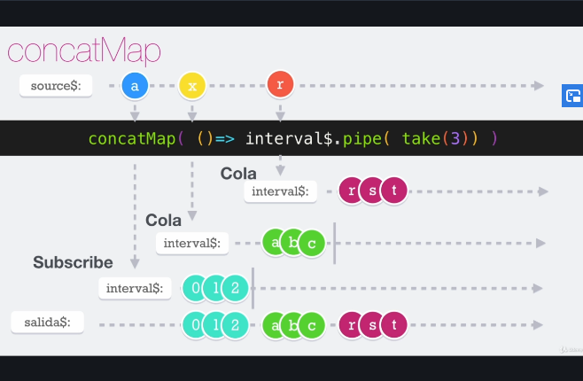
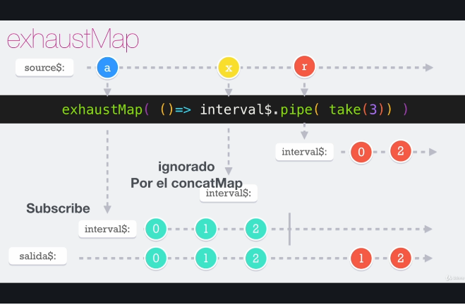

# ReactiveX con RxJS

**¿Cuándo usar Rx?**

- Eventos de la interfaz de usuario.
- Cuando es necesario notificar de cambios en un objeto(s).
- Comunicaciones por sockets.
- Cuando necesitamos trabajar con flujo de información (Streams).

El patrón ReactiveX o Observable tiene 3 conceptos fundamentales que lo componen. Ellos son:

1. Observables
   - Son la fuente de información
   - Pueden emitir multiples valores, sólo uno o ninguno.
   - Pueden emitir errores.
   - Pueder ser infinitos, finitos (Completarse).
   - Pueden ser síncronos o asíncronos.
2. Subscribers
   - Se suscriben a un Observable, es decir, están pendientes de lo que realiza el Observable.
   - Consumen / Observan la data del Observable.
   - Pueden recibir errores y eventos del Observable.
   - Desconocen todo lo que se encuentra detrás del Observable.
3. Operators
   - Usados para transformar Observables (map, group, scan…)
   - Usados para filtrar observables (filter, distinct, skip, debound…)
   - Usados para combinar observables
   - Usados para crear nuevos observables

**Beneficios de la programación reactiva**

1. Evitar el "Callback Hell"
2. Trabajar de forma simple tareas sincrónas y asíncronas.
3. Uso de operadores para reducir y simplificar el trabajo.
4. Es fácil transformar los flujos (Streams) de información.
5. Código más limpio y fácil de leer.
6. Fácil de implementar.
7. Fácil anexar procedimientos sin alterar el producto final.

**Patrones y paradigmas usados por ReactiveX**

1. Observer Pattern:

   - Notificar cuando suceden cambios.

2. Iterator Pattern

   - Poder ejecutar operaciones secuenciales.

3. Programación funcional
   - Tener funciones con tareas específicas que reciban argumentos y no muten la información

## Primer Observable

Los Observables son objetos que puede emitir multiples valores, uno o ninguno. En este punto debemos saber que el observable `obs$` puede emitir valores usando el metodo `next([valor])`el cual se verá reflejado en su salida. Al mismo tiempo, el metodo`complete()` le permite notificar que no emitirá ningun valor más en su salida aunque, puede que el este notificandolos.



La sintaxis de un Observable sencillo es así en Javascript:

```typescript
import { Observable } from "rxjs";

// const obs$ = Observable.create();
const obs$ = new Observable<string>((subscriber) => {
  subscriber.next("Hola");
  subscriber.next("Mundo");

  subscriber.next("Hola");
  subscriber.next("Mundo");

  subscriber.complete();

  // No emitirá estas lineas debido a que se completo
  subscriber.next("Hola");
  subscriber.next("Mundo");
});

obs$.subscribe(console.log);
//obs$.subscribe(res => console.log(res));
```

- El metodo Observable nos recibe una función subscriber que se encarga de generar las emisiones de datos entre otras operaciones fundamentales.
- Para escuchar tales cambios, tenemos que usar el metodo `subscribe()` que no recibe por parametro una función que contiene los resultados emitidos.
- Para marcar un observador como completo podemos usar el metodo `complete()` que detendrá todas las salidas que se encuentre posteriormente a su llamado.
- **Nota**: Un observer se iniciara unicamente si cuenta con almenos 1 _subcriber_.

## Observer y Suscriber

Como vimos anteriormente la sintaxis de como crear y suscribirnos a un Observable, es momento de dejar por centado las formas en las que podemos crear un _subscriber_:

- Especificando los callbacks directamente en el metodo `subscribe`:

```typescript
import { Observable } from "rxjs";

const obs$ = new Observable<string>((subscriber) => {
  subscriber.next("Hola");
  subscriber.next("Mundo");

  subscriber.next("Hola");
  subscriber.next("Mundo");

  // Esto genera un error
  let a = undefined;
  a.nomber = "nombre";

  subscriber.complete();

  subscriber.next("Hola");
  subscriber.next("Mundo");
});

obs$.subscribe(
  (value) => console.log(value), //Corresponde a las emisiones con next()
  (error) => console.log(error), //Corresponde a todos los errores generados por js
  () => console.log("Completado") //Corresponde a la finalizacion de un Observable
);
```

- **Nota**: Cuando se generá un error, el comportamiento por defecto hace que lo que se encuentre por debajo no se ejecute, incluso si es un llamado a `complete()`;

- Creando un objeto de tipo Observer:

```typescript
import { Observable, Observer } from "rxjs";

const observer: Observer<any> = {
   next: value => console.log(value),
   error: error => console.error(error),
   complete: () => console.info('Complete');
}

const obs$ = new Observable<string>((subscriber) => {
  subscriber.next("Hola");
  subscriber.next("Mundo");

  subscriber.next("Hola");
  subscriber.next("Mundo");

  // Esto genera un error
  let a = undefined;
  a.nomber = 'nombre';

  subscriber.complete();

  subscriber.next("Hola");
  subscriber.next("Mundo");
});

obs$.subscribe(observer);
```

## Subscription y unsubscribe

Bien, hasta el momento, hemos repasado temas fundamentales como la creación de un _Observable_ y la forma en la que podemos crear un _Observer_ o _Subscriber_. Llego el momento de saber como funciona el proceso de _subscription_ y de _unsubscribe_:

```typescript
const intervalo$ = new Observable<number>((subscriber) => {
  let counter = 0;

  const interval = setInterval(() => {
    counter++;
    subscriber.next(counter);
  }, 1000);

  return () => {
    clearInterval(interval);
    console.log("Intervalo destruido");
  };
});

const subs = intervalo$.subscribe((num) => console.log("Num: ", num));
const subs2 = intervalo$.subscribe((num) => console.log("Num: ", num));
const subs3 = intervalo$.subscribe((num) => console.log("Num: ", num));

setTimeout(() => {
  subs.unsubscribe();
  subs2.unsubscribe();
  subs3.unsubscribe();

  console.log("completado timeout");
}, 5000);
```

**IMPORTANTE**:

- Podemos asignar el _subscribe_ a una variable debido a que este metodo nos retorna un objeto de tipo `Subscription`. Dicho metodo nos permite ejecutar posteriormente acciones de `unsubscribe` o de limpieza del Observador.
- **Cuando creamos un Observador o Subscription este ejecuta por defecto nuevamente el codigo que se halla dentro del Observable para esa instancia**. Es decir cada uno tiene su instancia separada y puede laborar con valores independientes.
- Para efectos de limpieza del intervalo, podemos hacer uso de la expresion `return` donde pasamos una funcion la cual se ejecutará cuando el _Observer_ haga uso del metodo `unsubscribe()`.

Todo lo anterior mostrado es una configuración manual de como crear un Observer. RxJS nos provee alternativas built-in que nos ahorran el tiempo de hacerlo a mano, pero por efectos de aprendizaje, es bueno saber como se constituyen los Observables y los demas componentes.

## Terminar Observables en cadena

Anteriormente venimos manejando nuestro codigo con llamados independientes para cada uno de nuestro Observers. Podemos reducir codigo usado el metodo `add()` que nos entrega el tipo `Subscription`. Add permite agregar nuevos Observer y dejar que el primero sea el encargado de gestionar automaticamente los demas segun la implementación que le den a el.

```typescript
const observer: Observer<any> = {
  next: (value) => console.log(value),
  error: (error) => console.warn(error),
  complete: () => console.log("Completado"),
};

const intervalo$ = new Observable<number>((subscriber) => {
  let counter = 0;

  const interval = setInterval(() => {
    counter++;
    subscriber.next(counter);
  }, 1000);

  setTimeout(() => {
    subscriber.complete();
  }, 2500);

  return () => {
    clearInterval(interval);
    console.log("Intervalo destruido");
  };
});

const subs = intervalo$.subscribe(observer);
const subs2 = intervalo$.subscribe(observer);
const subs3 = intervalo$.subscribe(observer);

//Encadena los Observers y nos permite operarlos desde el principal
subs.add(subs2).add(subs3);

setTimeout(() => {
  // Termina la subscripcion de todos los Observers encadenados
  subs.unsubscribe();

  console.log("completado timeout");
}, 5000);
```

**IMPORTANTE**:

- `unsubscribe` no es lo mismo que `complete()`. Estos dos son metodos diferentes que ocurren en tiempos aislados. Primero se ejecuta `complete` que determina un estado del _Observable_, mientras que, `unsubscribe` deja de escuchar los cambios en un _Observable_ y ejecuta el codigo de limpieza que se encuentra en el `return`.
- cuando encadenamos los _Observer_ no es necesario repetir el metodo `unsubscribe` por cada una de las instancias creadas. Podemos realizar las operaciones sobre la instancia principal y esta se encagará de propagar los llamados a los encadenados a el.

## Subject

Entremos en contexto, cuando nos suscribimos a un _Observable_ estamos creando instancias independientes, lo cual, nos trae valores independientes para cada una de los Observers que hemos declarado. ¿Como podemos hacer que todas las instancias que creemos siempre reciban el mismo valor? Facil, **Subjet** Nos ayuda a realizar casting de multiples Observadores y nos permite acceder a un mismo valor en cualquiera de ellos.

Veamos algunas de las propiedades de este componente:

- Casteo multiple.
- También es un Observer
- Podemos manejar tambíen el Next, Error y Complete.

```typescript
import { Observable, Observer, Subject } from "rxjs";

const observer: Observer<any> = {
  next: (value) => console.log(value),
  error: (error) => console.warn(error),
  complete: () => console.log("Completado"),
};

const interval$ = new Observable((subscriber) => {
  const intervalID = setInterval(() => subscriber.next(Math.random()), 1000);
  return () => {
    clearInterval(intervalID);
    console.log("intervalo destruido");
  };
});

const subject$ = new Subject();
const subscription = interval$.subscribe(subject$);

const subs1 = subject$.subscribe(observer);
const subs2 = subject$.subscribe(observer);

setTimeout(() => {
  // Lo podemos hacer debido a Subject es un Observable.
  subject$.next(10);
  subject$.complete();

  subscription.unsubscribe();
}, 3500);
```

**IMPORTANTE**:

- Cuando los datos son producidos por el _Observable_ en sí mismo, es considerado un "Cold Observable". Pero cuando los datos son producidos FUERA del _Observable_ es llamado un "Hot Observable". En este cado nuestro _Hot Observable_ es nuestra instancia de `Subject`.
- Como aprendimos, `Subject` es un _Observer_ este puede emitir nuevos valores, errores e incluso marcar como completada la tarea.
- Podemos usar nuestro _Observer_ personalizado al momento de realizar las subscripciones y no vamos a tener ningun problema.

## Funciones para crear Observables

### [of](https://rxjs-dev.firebaseapp.com/api/index/function/of)

Crea _Observables_ en base a una lista elementos. Este emite los valores en secuencia de forma sincrona.

```typescript
import { of } from "rxjs";

const obs$ = of<number>(1, 2, 3, 4, 5, 6);
/* const obs2$ = of(
  [1, 2],
  { a: 2, b: 5 },
  function () {},
  Promise.resolve(true),
  false
); */

obs$.subscribe(
  (next) => console.log("next", next), // 1 2 3 4 5 6
  null,
  () => console.log("Secuencia completada")
);
```

- Los resultados de next son automaticos y sincronos.
- El metodo `complete` es ejecutado automaticamente por RxJS

### [fromEvent](https://rxjs-dev.firebaseapp.com/api/index/function/fromEvent)

Nos permite crear _Observables_ en base a un Event Target. Por defecto no hay un fin para estos eventos, sin embargo, podemos cancelar la subscripción o terminarlo en cualquier momento.

```typescript
import { fromEvent } from "rxjs";

const keyboardEvent$ = fromEvent<KeyboardEvent>(document, "keydown");
const clickEvent$ = fromEvent<MouseEvent>(document, "click");

keyboardEvent$.subscribe((ev) => {
  console.log(ev.key);
});

clickEvent$.subscribe((ev) => {
  console.log(ev.clientY);
});
```

- El tipo debe ser el adecuado para el evento el cual queremos escuchar.

### [range](https://rxjs-dev.firebaseapp.com/api/index/function/range)

Crea un _Observable_ que emite una secuencia de numeros en base a un rango en especifico. Se ejecutan por naturaleza sincronamente pero puede ser asincronos con el uso de un `asyncScheduler`.

**IMPORTANTE**: El valor que da como resultado es una emision, no un contador, es decir, si ponemos `range(-5, 10)`, no va a crear un contador recorriendo del numero -5 al numero 10, en cambio, el nos va a emitir unicamente 10 valores que van a arrancar desde el numero -5.

`-5, -4, -3, -2, -1, 0, 1, 2, 3, 4`

```typescript
import { range, asyncScheduler } from "rxjs";

//Agenda el proceso en el eventLoop y lo ejecuta de manera asincrona
const src$ = range(1, 5, asyncScheduler);
// Empieza en 0 y termina en 5
//const src$ = range(5);

console.log("inicio");
src$.subscribe(console.log);
console.log("fin");
```

### [interval](https://rxjs-dev.firebaseapp.com/api/index/function/interval)

Crea un _Observable_ que emite numeros sequenciales en cada intervalo de tiempo especificado. Por defecto este timer se ejecuta infinitamente hasta que se use un operador que indique su finalización.

```typescript
import { interval } from "rxjs";

const observer = {
  next: (val) => console.log(val),
  complete: () => console.log("Completado"),
};

const interval$ = interval(2000);

console.log("Inicio");
interval$.subscribe(observer);
console.log("fin");
```

- Este codigo se ejecuta de forma asincrona.
- Podemos modificar la salida del _Observable_ usando operadores.

### [timer](https://rxjs-dev.firebaseapp.com/api/index/function/timer)

Crea un _Observable_ que empieza a emitir después de un tiempo de espera y luego incrementa los valores después de cada periodo de tiempo indicado.

```typescript
import { timer } from "rxjs";

const observer = {
  next: (val) => console.log(val),
  complete: () => console.log("Completado"),
};

/* Se ejecuta finitamente a los 2 segundos
const timer$ = timer(2000);
 */

/* Se ejecuta primero al esperar 5 segundos y luego se ejecuta infinitamente
cada segundo
const timer$ = timer(5000, 1000) */

const today = new Date();
today.setHours(today.getHours() - 2);

// Se ejecuta según la fecha especificada por nosotros.
const timer$ = timer(today);

console.log("Inicio");
timer$.subscribe(observer);
console.log("fin");
```

- Este timer puede ejecutarse una sola vez segun el periodo de tiempo de inicio y de ahí en adelante apartir del tiempo indicado de intervalo.
- Puede recibir como argumento inicial una Fecha especifica.

### [asyncScheduler](https://rxjs-dev.firebaseapp.com/api/index/const/asyncScheduler)

Agenda tareas asincronamente poniendolas en la cola del Event Loop de JavaScript. _asyncScheduler_ crea una subscripción, por lo tanto no es un _Observable_ y no podemos tratarlo como tal.

```typescript
import { asyncScheduler } from "rxjs";

const saludar = () => console.log("hola mundo");
const saludar2 = (nombre) => console.log(`Hola ${nombre}`);

//SET TIMEOUT
asyncScheduler.schedule(saludar, 2000);
/* 
Pasamos la funcion, el timer y el estado del Scheduler
*/
asyncScheduler.schedule(saludar2, 2000, "Steven");

//SET INTERVAL
const subs = asyncScheduler.schedule(
  function (state: number) {
    console.log("state", state);
    // No podemos usar arrow functions aqui
    this.schedule(state + 1, 1000);
  },
  3000,
  0
);

// Como es una subscripcion podemos desubscribirnos cuando queramos usando
// Schedulers tambien
asyncScheduler.schedule(() => subs.unsubscribe(), 6000);
```

### [from](https://rxjs-dev.firebaseapp.com/api/index/function/from)

Crea un observable apartir de un Array, un arreglo como objeto, una promesa, un objeto iterable, o un objeto _Observable_.

```typescript
import { from } from "rxjs";

const observer = {
  next: (val) => console.log(val),
};

const generator = function* () {
  yield 1;
  yield 2;
  yield 3;
  yield 4;
  yield 5;
};

const myIterable = generator();

//ejecuta el iterable y me devuelve todos los valores
from(myIterable).subscribe(observer);

//ejecuta la promesa y me devuelve el resultado
from(fetch("https://miUrl.com/")).subscribe(observer);
```

## Operadores

**¿Qué son los operadores?**

Los operadores en teoria funcionan como tuberias que nos permite modificar el resultado del flujo de información para que se acomode a nuestras necesidades.

### [map](https://rxjs-dev.firebaseapp.com/api/operators/map)

Aplica una funcion data a cada valor emitido por el _Observable_ source y emite los valores resultantes como un _Observable_

```typescript
import { range, fromEvent } from "rxjs";
import { map } from "rxjs/operators";

range(1, 5)
  .pipe(map<number, number>((value) => value * 10))
  .subscribe(console.log); //muestra los valores * 10

fromEvent<MouseEvent>(document, "click")
  .pipe(map<MouseEvent, number>((value) => value.pageX))
  .subscribe(console.log); //muestra el valor de pagina en X unicamente
```

- Las importaciones de los operadores se hacen desde la carpeta `rxjs/operators`
- Los operadores se usan dentro de la función `pipe()` que nos permite encadenar operadores al _Observable_

### [pluck](https://rxjs-dev.firebaseapp.com/api/operators/pluck)

Nos permite extraer un valor de un objeto y que dicho valor se convierta en la salida de nuestro _Observable_ y así poder operar apartir de ese valor. Si `pluck` no encuentra una coincidencia, devolverá indefinido.

```typescript
import { fromEvent } from "rxjs";
import { map, pluck } from "rxjs/operators";

const event$ = fromEvent<MouseEvent>(document, "click");

const eventPluck$ = event$.pipe(pluck("target", "baseURI")); //Nested props
const eventMap$ = event$.pipe(map<MouseEvent, number>((value) => value.pageX));

event$.subscribe(console.log);
eventMap$.subscribe((val) => console.log("map", val));
eventPluck$.subscribe((val) => console.log("pluck", val));
```

### [mapTo](https://rxjs-dev.firebaseapp.com/api/operators/mapTo)

Emite una constante indicada en la salida del _Observable_ cada vez que el _Observable_ source emite un valor.

```typescript
import { fromEvent } from "rxjs";
import { map, pluck, mapTo } from "rxjs/operators";

const event$ = fromEvent<MouseEvent>(document, "click");

const eventPluck$ = event$.pipe(pluck("target", "baseURI"));
const eventMap$ = event$.pipe(map<MouseEvent, number>((value) => value.pageX));
const eventMapTo$ = event$.pipe(mapTo({ v: 10 }));

event$.subscribe(console.log);
eventMap$.subscribe((val) => console.log("map", val));
eventPluck$.subscribe((val) => console.log("pluck", val));
eventMapTo$.subscribe((val) => console.log("mapTo", val)); // Siempre retorna el objeto cuando se ejecuta el Observable
```

**IMPORTANTE**: el `mapTo` puede emitir cualquier valor que le indiquemos, desde objetos literales hasta strings literales.

- La utilidad de este operador es que podemos crear constantes que se deben ejecutar siempre que un evento o _Observable_ lo haga.

### [filter](https://rxjs-dev.firebaseapp.com/api/operators/filter)

Filtra los elementos emitidos por el _Observable_ source y solo emite aquellos que cumplen con la condición especificada.

```typescript
import { from } from "rxjs";
import { filter } from "rxjs/operators";

interface Characters {
  type: string;
  name: string;
}

const characters: Characters[] = [
  {
    type: "heroe",
    name: "Batman",
  },
  {
    type: "heroe",
    name: "Robin",
  },
  {
    type: "villian",
    name: "Joken",
  },
];

from(characters)
  .pipe(filter((c, index) => c.type === "villian"))
  .subscribe(console.log);
```

### Cadena de operadores

Los operadores pueden ser encadena dos para crear manipulaciones más profundas del flujo de información (Stream). Los operadores son ejecutados de arriba hacia abajo cuando son encadenados y el resultado del primero sera el input del segundo, y así sucesivamente con lo demás.

```typescript
import { fromEvent } from "rxjs";
import { filter, pluck, mapTo } from "rxjs/operators";

fromEvent(document, "keyup")
  .pipe(
    pluck("code"),
    filter((key) => key === "Enter"),
    mapTo("El Usuario a presionado Enter")
  )
  .subscribe(console.log);
```

### [tap](https://rxjs-dev.firebaseapp.com/api/operators/tap)

Permite realizar efectos colaterales por cada una de las emisiones del _Observable_ source, aunque el return es ignorado, este siempre devuelve un _Observable_ identico al source.

```typescript
import { range } from "rxjs";
import { map, tap } from "rxjs/operators";

const numeros$ = range(1, 5);

numeros$
  .pipe(
    tap((x) => {
      console.log("antes", x);
      return 100; //No es tomado en cuenta
    }),
    map((val) => val * 10),
    tap({
      next: (valor) => console.log("despues", valor),
      complete: () => console.log("se completo todo"),
    }) // Partial Observer
  )
  .subscribe((val) => console.log("subs", val));
```

- Los valores retornados dentro de `tap` son ignorados.
- Podemos crear _Observers_ parciales que ejecuten cierta logica según cada valor, sin alterar el flujo de información.
- Muy útil para debug y analytics.

### [reduce](https://rxjs-dev.firebaseapp.com/api/operators/reduce)

Aplica una función acumuladora sobre un _Observable_ source y retorna el resultado acumulado cuando el _Observable_ se complete. Podemos dar un valor inicial si se quiere.

```typescript
import { interval } from "rxjs";
import { take, reduce, tap } from "rxjs/operators";

const totalReducer = (acc: number, curr: number) => {
  return acc + curr;
};

interval(1000)
  .pipe(
    take(3), //Completa el Obs$ cuando se cuenten 3 emisiones
    tap(console.log),
    reduce(totalReducer) //El valor inicial por def es 0
  )
  .subscribe({
    next: (val) => console.log("val", val),
    complete: () => console.log("Completado"),
  });
```

- El operador `take` completa el _Observable_ cuando llegue a 3 emisiones.
- El `reducer` solo puede emitir valor cuando se completa el total de emisiones en el _Observable_ source.

### [scan](https://rxjs-dev.firebaseapp.com/api/operators/scan)

Aplica una función acumuladora sobre un _Observable_ source y retorna cada resultado intermedio. En pocas palabras, este operador nos permite emitir el resultado del acumulado en cada iteración. Podemos dar un valor inicial al acumulador si se quiere.

```typescript
import { from } from "rxjs";
import { scan, reduce, map } from "rxjs/operators";

const numeros = [1, 2, 3, 4, 5, 6];

const totalAcumulador = (acc: number, curr: number) => {
  return acc + curr;
};

//Reduce
from(numeros).pipe(reduce(totalAcumulador, 0)).subscribe(console.log);

//Scan
from(numeros).pipe(scan(totalAcumulador, 0)).subscribe(console.log);

//Redux example
interface Usuario {
  id?: string;
  auth?: boolean;
  token?: string;
  edad?: number;
}

const user: Usuario[] = [
  { id: "stv", auth: false, token: null },
  { id: "stv", auth: true, token: "ADWA" },
  { id: "stv", auth: true, token: "EWAE210" },
];

const state$ = from(user).pipe(
  scan<Usuario>(
    (acc, curr) => {
      return { ...acc, ...curr };
    },
    { edad: 33 }
  )
);

const id$ = state$.pipe(
  map((state) => state.id) //Unicamente retorne el id
);

id$.subscribe(console.log);
```

### [take](https://rxjs-dev.firebaseapp.com/api/operators/take)

Emite solo el numero maximo de valores next emitidos por el _Observable_ source. Este numero maximo lo especificamos como argumento `count`. Cuando el operador sabe que es el ultimo valor a emitir, cierra el canal de subscripción y deja de emitir cualquier tipo de valor que este siendo pasado por el _Observable_, incluso los errores.

```typescript
import { of } from "rxjs";
import { take, tap } from "rxjs/operators";

const numeros$ = of(1, 2, 3, 4, 5);

numeros$
  .pipe(
    tap((t) => console.log("tap", t)),
    take(3) //Finaliza o cancela la ejecución del obs$ source cuando complete el numero de emisiones
  )
  .subscribe({
    next: (val) => console.log("next:", val),
    complete: () => console.log("completado"),
  });
```

- Es importante saber que cuando `take` alcanza el maximo de emisiones, se cancela el _Observable_ source.

### [first](https://rxjs-dev.firebaseapp.com/api/operators/first)

Emite unicamente el primer valor (o el primer valor que se conoce por medio de alguna condicion) emitido por el _Observable_ source.

```typescript
import { fromEvent } from "rxjs";
import { first } from "rxjs/operators";

fromEvent<MouseEvent>(document, "click")
  //Se emite un valor unicamente si la condición es verdadera y luego se
  //completa el Obs$
  .pipe(first((event) => event.clientY >= 200))
  .subscribe({
    next: (val) => console.log("next", val),
    complete: () => console.log("Completed"),
  });
```

**IMPORTANTE**: Cuando la condición no se satisface aún, el _Observable_ source no emite ningún y el subscriptor no recibe nada.

- Cuando se cumple la condición, se emite el valor y se completa.
- Al no pasar una condición, este retorna unicamente el primer valor emitido y luego se completa.

### [takeWhile](https://rxjs-dev.firebaseapp.com/api/operators/takeWhile)

Emite valores emitidos por el _Observable_ source tan pronto como cada valor satisface la funcion de condicion indicada, luego, se completa tan pronto como la funcion de condicion no se satisface.

Podemos indicarle al operador que nos emita el valor que rompe con nuestra condición pasandole el parametro `inclusive` marcado como true.

```typescript
import { fromEvent } from "rxjs";
import { takeWhile, map } from "rxjs/operators";

fromEvent<MouseEvent>(document, "click")
  //Emite valores menores a 200 hasta que recibe un valor mayor
  //a la condicion espeficida, ademas imprime el valor que rompe
  //la emisión.
  .pipe(
    map(({ x, y }) => ({ x, y })),
    takeWhile(({ y }) => y <= 200, true)
  )
  .subscribe({
    next: (val) => console.log("next", val),
    complete: () => console.log("Completed"),
  });
```

### [takeUntil](https://rxjs-dev.firebaseapp.com/api/operators/takeUntil)

Emite los valores emitidos por el _Observable_ source hasta que un _Observable_ notificador emite un valor.

```typescript
import { interval, fromEvent } from "rxjs";
import { takeUntil } from "rxjs/operators";

const button = document.createElement("button");
button.innerHTML = "Detener Timer";

document.querySelector("body").append(button);

const counter$ = interval(1000);
const clickBtn$ = fromEvent(button, "click");

counter$.pipe(takeUntil(clickBtn$)).subscribe({
  next: (val) => console.log(val),
  complete: () => console.log("Completado"),
});
```

- Se completa el _Observable_ source cuando el _Observable_ notificador emite su primer valor.

### [skip](https://rxjs-dev.firebaseapp.com/api/operators/skip)

Retorna un _Observable_ que omite los elementos emitidos por el _Observable_ source segun la cantidad especificada a omitir.

```typescript
import { interval, fromEvent } from "rxjs";
import { takeUntil, skip } from "rxjs/operators";

const button = document.createElement("button");
button.innerHTML = "Detener Timer";

document.querySelector("body").append(button);

const counter$ = interval(1000);
const clickBtn$ = fromEvent(button, "click").pipe(skip(1)); // Emite su valor click hasta el segundo click efectuado;

counter$.pipe(takeUntil(clickBtn$)).subscribe({
  next: (val) => console.log(val),
  complete: () => console.log("Completado"),
});
```

### [distinct](https://rxjs-dev.firebaseapp.com/api/operators/distinct)

Retorna un _Observable_ que emite todos los elementos emitidos por el _Observable_ source que son distintos por comparación a todos los elementos previamente emitidos por el _Observable_ source.

**IMPORTANTE**: Distinct usa el operador equality '===' para realizar las comparaciones. Ademas si queremos aceptar valores repetido no secuancialmente, `distinct` no nos servirá.

```typescript
import { of, from } from "rxjs";
import { distinct } from "rxjs/operators";

const numeros$ = of(1, 1, 1, 2, 2, 2, 3, 3, 4, 4, 4, 6, 6, 6);

numeros$.pipe(distinct()).subscribe(console.log);

interface personaje {
  name: string;
}

const personajes: personaje[] = [
  {
    name: "Megaman",
  },
  {
    name: "X",
  },
  {
    name: "Zero",
  },
  {
    name: "Mr Prro",
  },
  {
    name: "Megaman",
  },
  {
    name: "Megaman",
  },
  {
    name: "Megaman",
  },
];

from(personajes)
  .pipe(distinct((i) => i.name))
  .subscribe(console.log);
```

- Si no le pasamos el keySelector el va hacer comparaciones shallow. Por el contrario podemos especificarle sobre que propiedad queremos validar la unicidad.

### [distinctUntilChanged](https://rxjs-dev.firebaseapp.com/api/operators/distinctUntilChanged)

Retorna un _Observable_ que emite todos los elementos emitidos por el _Observable_ source que son distintos de el elemento anterior por comparacion.

```typescript
import { of, from } from "rxjs";
import { distinctUntilChanged } from "rxjs/operators";

const numeros$ = of<number | string>(
  1,
  1,
  1,
  2,
  1,
  2,
  3,
  3,
  4,
  "3",
  4,
  6,
  6,
  6
);

numeros$.pipe(distinctUntilChanged()).subscribe(console.log);

interface personaje {
  name: string;
}

const personajes: personaje[] = [
  {
    name: "Megaman",
  },
  {
    name: "X",
  },
  {
    name: "Zero",
  },
  {
    name: "Mr Prro",
  },
  {
    name: "Megaman",
  },
  {
    name: "Megaman",
  },
  {
    name: "Megaman",
  },
];

from(personajes)
  .pipe(
    //Si la condicion en true no va a emitir el valor
    distinctUntilChanged((prev, curr) => prev.name === curr.name)
  )
  .subscribe(console.log);
```

### [distinctUntilKeyChanged](https://rxjs-dev.firebaseapp.com/api/operators/distinctUntilKeyChanged)

Returna un _Observable_ que emite todos los elementos emitidos por el _Observable_ source que son distintos de su elemento anterior por medio de una comparacion que usa una llave provista para acceder a la propiedad y verificar que los dos elementos son distintos.

```typescript
import { from } from "rxjs";
import { distinctUntilKeyChanged } from "rxjs/operators";

interface personaje {
  name: string;
}

const personajes: personaje[] = [
  {
    name: "Megaman",
  },
  {
    name: "X",
  },
  {
    name: "Zero",
  },
  {
    name: "Mr Prro",
  },
  {
    name: "Megaman",
  },
  {
    name: "Megaman",
  },
  {
    name: "Megaman",
  },
];

from(personajes)
  .pipe(
    //Verifica que los elementos sucesivos no sean iguales segun la prop
    distinctUntilKeyChanged("name")
  )
  .subscribe(console.log);
```

## Operadores de tiempo

### [debounceTime](https://rxjs-dev.firebaseapp.com/api/operators/debounceTime)

Emite un valor del _Observable_ source que se encuentra dentro del periodo de espera o de intervalo especificado. El ultimo valor dentro del rango
de espera especificado será el emitido, los anteriores serán ignorados.

```typescript
import { fromEvent } from "rxjs";
import { debounceTime } from "rxjs/operators";

//Emite el ultimo valor cuando pasa 1seg sin emision.
fromEvent(document, "click").pipe(debounceTime(1000)).subscribe(console.log);
```

```typescript
import { fromEvent } from "rxjs";
import { debounceTime, pluck, distinctUntilChanged } from "rxjs/operators";

const input = document.createElement("input");
document.querySelector("body").append(input);

const input$ = fromEvent(input, "keyup");

input$
  .pipe(debounceTime(1000), pluck("target", "value"), distinctUntilChanged())
  .subscribe(console.log);
```

### [throttleTime](https://rxjs-dev.firebaseapp.com/api/operators/throttleTime)

Emite un valor de un _Observable_ source, luego ignora los valores subsecuentes que se encuentre dentro del `duration` especificado y luego repite el proceso.

```typescript
import { fromEvent, asyncScheduler } from "rxjs";
import { throttleTime, pluck, distinctUntilChanged } from "rxjs/operators";

const input = document.createElement("input");
document.querySelector("body").append(input);

const input$ = fromEvent(input, "keyup");

input$
  .pipe(
    throttleTime(1000, asyncScheduler, { leading: true, trailing: true }),
    pluck("target", "value"),
    distinctUntilChanged()
  )
  .subscribe(console.log);
```

- Este operador recibe tambien una configuracion que nos permite emitir el primer valor y el ultimo también. Dichas propiedades son: `leading` y `trailing` respectivamente.

### [sampleTime](https://rxjs-dev.firebaseapp.com/api/operators/sampleTime)

Emite el más reciente valor emitido desde un _Observable_ source dentro de intervalos periodicos de tiempo.

```typescript
import { fromEvent } from "rxjs";
import { sampleTime, pluck } from "rxjs/operators";

const click$ = fromEvent<MouseEvent>(document, "click");

click$.pipe(sampleTime(2000), pluck("x")).subscribe(console.log);
```

### [sample](https://rxjs-dev.firebaseapp.com/api/operators/sample)

Emite el valor más reciente emitido por el _Observable_ source cuando sea que otro _Observable_ notificador emite su primer valor.

```typescript
import { fromEvent } from "rxjs";
import { sample, pluck } from "rxjs/operators";

const click$ = fromEvent<MouseEvent>(document, "click");
const keyup$ = fromEvent<KeyboardEvent>(document, "keyup");

click$.pipe(sample(keyup$), pluck("x")).subscribe(console.log);
```

### [auditTime](https://rxjs-dev.firebaseapp.com/api/operators/auditTime)

Ignora valores del source durante un periodo especificado, luego emite el valor más reciente proveniente del _Observable_ source, después repite el proceso.

```typescript
import { fromEvent } from "rxjs";
import { auditTime, pluck } from "rxjs/operators";

const click$ = fromEvent<MouseEvent>(document, "click");

click$.pipe(auditTime(2000), pluck("x")).subscribe(console.log);
```

## Peticiones AJAX

RxJS nos permite usar un manejador de peticiones basado en Fetch construido por ellos, pero con los beneficios de los Observables. Esta utilidad la podemos sacar de:

`ìmport { ajax } from 'rxjs/ajax'`

### [catchError](https://rxjs-dev.firebaseapp.com/api/operators/catchError)

Atrapa los errores en el _Observable_ para ser manejados retornando un nuevo _Observable_ o lanzando un Error.

**IMPORTANTE**: Este metodo sirve para cualquier tipo de _Observable_, no es exclusivo de ajax.

```typescript
import { ajax, AjaxError } from "rxjs/ajax";
import { pluck, catchError } from "rxjs/operators";
import { of } from "rxjs";

const url = "https://api.github.com/users?per_page=5";

const errorCatcher = (err: AjaxError) => {
  console.warn("error", err.message);
  return of([]);
};

ajax(url)
  .pipe(pluck("response"), catchError(errorCatcher))
  .subscribe(console.log);
```

- Este operador nos permite ejecutar un nuevo _Observable_ en caso de error y de ser ese el escenario, podemos seguir recibiendo valores del _Observable_ especificado dentro del error.
- Si no pasamos un nuevo _Observable_ la alternativa que tenemos es retornar o lanzar un Error.

### [getJSON](https://rxjs-dev.firebaseapp.com/api/ajax/ajax#using-ajax-getjson-to-fetch-data-from-api-)

Este metodo nos permite realizar peticiones AJAX de forma corta y un poco más sencilla. El resultado que nos entrega este, difiere del metodo tradicional.

```typescript
ajax
  .getJSON(url, {
    "Content-Type": "application/json",
    "My-Token": "ADWADF2121",
  })
  .subscribe((data) => console.log("data", data));
```

### Diferencias entre getJSON y ajax

Las diferencias principales entre estos dos metodos es la forma en la que manipula la respuesta obtenida desde el servidor.

- `getJSON`: Nos devuelve la información parseada a JSON con algunos elementos demás, como los headers que enviamos, etc.
- `ajax`: Caso contrario a `getJSON` devuelve los datos dentro de un ReadableStream

## Operadores de transformación/aplanamiento

Estos operadores de transformación o aplanamiento nos permiten suscribirnos a un _Observable_ retornado por otro _Observable_ y recibir los datos en la misma linea de tiempo en la que se esta ejecutando.

Este nos viene perfecto en el escenario en el cual estamos recibiendo un _Observable_ como emision dentro de nuestra subscripcion. Podemos aplanarlo para que sin importar que pase siempre recibamos nuestra información lista para consumir.

### [mergeAll](https://rxjs-dev.firebaseapp.com/api/operators/mergeAll)

Convierte un higher-order _Observable_ en un first-order _Observable_ el cual entrega concurrentemente todos los valores que son emitidos en los _Observables_ internos.

`mergeAll` se marcará como _complete_ cuando todos sus _Observables_ se hayan completado, sin importar si el _Observable_ source se ha completado ya.

```typescript
// Streams
const input$ = fromEvent<KeyboardEvent>(textInput, "keyup");

input$
  .pipe(
    debounceTime<KeyboardEvent>(500),
    pluck<KeyboardEvent, string>("target", "value"),
    map<string, Observable<GithubUsersResp>>((texto) =>
      ajax.getJSON(`https://api.github.com/search/users?q=${texto}`)
    ),
    mergeAll<GithubUsersResp>(), //Aplana los observables internos y emite valor cuando los observables a los que se suscribio emiten alguno
    pluck<GithubUsersResp, GithubUser[]>("items")
  )
  .subscribe(mostrarUsuarios);
```

- Este codigo nos permite ahorrar codigo en el momento que recibimos en un subscribe un nuevo Observable. `mergeAll` nos permite aplanar todos los _Observables_ y se encarga de emitir valores cuando alguno a los cuales esta suscrito emite algun dato.

### [mergeMap](https://rxjs-dev.firebaseapp.com/api/operators/mergeMap)

Proyecta cada valor del source a un _Observable_ el cual es unido en el _Observable_ de salida.

En mejores palabras, `mergeMap` recibe todos los valores del _Observable_ source y crea un nuevo _Observable_ interno que emitirá valores que se verán reflejados en la linea de tiempo del _Observable_ source. Para que el _Observable_ source se marque como _complete_ todos los internos deben haberse marcado como _complete_.



```typescript
import { of, interval, fromEvent } from "rxjs";
import { mergeMap, take, map, takeUntil } from "rxjs/operators";

const letras$ = of("a", "b", "c");

letras$.pipe(
  mergeMap((letra) =>
    interval(1000).pipe(
      map((i) => letra + 1), //Recibe el valor del interval
      take(3)
    )
  )
);
/*  .subscribe({
    next: (val) => console.log("next:", val),
    complete: () => console.log("complete"),
  }); */

const mouseDown$ = fromEvent(document, "mousedown");
const mouseUp$ = fromEvent(document, "mouseup");
const interval$ = interval();

mouseDown$
  .pipe(mergeMap(() => interval$.pipe(takeUntil(mouseUp$))))
  .subscribe(console.log);
```

### [switchMap](https://rxjs-dev.firebaseapp.com/api/operators/switchMap)

Proyecta cada valor del _Observable_ source a un nuevo _Observable_ interno el cual es unido en la salida del _Observable_ source, emitiendo unicamente los valores provenientes del _Observable_ interno proyectado más reciente.

**IMPORTANTE**: Cuando se emite el valor más reciente proyecto se cancela los valores anteriores. Es muy util para manejar peticiones AJAX.



```typescript
const url = "https://httpbin.org/delay/1?arg="; // + steven

input$
  .pipe(
    pluck("target", "value"),
    switchMap((texto) => ajax.getJSON(url + texto))
  )
  .subscribe(console.log);
```

- Este codigo se plantea hacer una petición a un API cuando escribamos algun valor en el input. Tenemos un problema, cada que se escribe algo se envia una peticion y puede que estemos trayendo informacion que no necesitamos.
- `switchMap` nos permite cancelar las peticiones anteriores o intermedias mientras escribimos y nos devuelve unicamente la más reciente. De esa forma podemos limpiar nuestra app de peticiones innecesarias.

### mergeMap vs switchMap

```typescript
import { fromEvent, interval } from "rxjs";
import { mergeMap, switchMap } from "rxjs/operators";

const click$ = fromEvent(document, "click");
const interval$ = interval(1000);

click$
  .pipe(
    switchMap(() => interval$)
    // mergeMap( () => interval$ ),
  )
  .subscribe(console.log);
```

- `switchMap` mantiene un unico _Observable_ interno activo, es decir cuando demos click el _Observable_ anterior se completará y dará paso al siguiente.
- `mergeMap` crea n cantidad de _Observables_ cada vez que se haga click y estos estarán corriendo paralelamente lo cual si no lo controlamos puede darnos problemas de memoria.

### [concatMap](https://rxjs-dev.firebaseapp.com/api/operators/concatMap)

Permite concatenar los _Observables_ internos pueden fluir atraves de dicho operador. Este operador de aplanamiento nos permite concatenar resultados haciendo uso de una cola. Veamos un ejemplo de esto:

Si nuestro operador de aplanamiento recibe un nuevo valor del source (A) crea y se suscribe al nuevo _Observable_ interno y empieza a emitir sus valores, ahora, cuando a nuestro operador le llega un nuevo valor del source (B), este lo crea y se suscribe a un nuevo _Observable_ interno pero en lugar de empezar a emitir valores en paralelo, lo agenta en una _cola_ de espera, en donde el nuevo _Observable_ espera a que el _Observable_ (A) se complete para poder emitir y ejecutar sus valores de _Observable_ (B).



```typescript
import { interval, fromEvent } from "rxjs";
import { take, switchMap, concatMap } from "rxjs/operators";

const interval$ = interval(500).pipe(take(3));
const click$ = fromEvent(document, "click");

click$.pipe(concatMap(() => interval$)).subscribe(console.log);
```

### [exhaustMap](https://rxjs-dev.firebaseapp.com/api/operators/exhaustMap)

Este operador de aplanamiento recibe un nuevo valor del source (A) y crea y se suscribe al nuevo _Observable_ interno y empieza a emitir sus valores,
ahora llega un nuevo valor del source (B), repite el proceso, pero este será ignorado debido a que (A) no se ha completado. Siguiente a eso (A) se marca como _completado_ y llega un nuevo valor de source (C), repite el proceso y empieza a emitir valores debido a que no tiene _Observables_ internos sin completar. En resumen (B) quedó descartado completamente y no se vuelve a ejecutar en el futuro.



```typescript
import { interval, fromEvent } from "rxjs";
import { take, exhaustMap } from "rxjs/operators";

const interval$ = interval(500).pipe(take(3));
const click$ = fromEvent(document, "click");

click$.pipe(exhaustMap(() => interval$)).subscribe(console.log);
```

### Ejercicio con operadores de aplanamiento

```typescript
import { fromEvent, of } from "rxjs";
import {
  tap,
  map,
  mergeMap,
  pluck,
  catchError,
  switchMap,
  exhaustMap,
} from "rxjs/operators";
import { ajax } from "rxjs/ajax";

// Helper
const peticionHttpLogin = (userPass) =>
  ajax.post("https://reqres.in/api/login?delay=1", userPass).pipe(
    pluck("response", "token"),
    catchError((err) => of("xxx"))
  );

// creando un formulario
const form = document.createElement("form");
const inputEmail = document.createElement("input");
const inputPass = document.createElement("input");
const submitBtn = document.createElement("button");

// Configuraciones
inputEmail.type = "email";
inputEmail.placeholder = "Email";
inputEmail.value = "eve.holt@reqres.in";

inputPass.type = "password";
inputPass.placeholder = "Password";
inputPass.value = "cityslicka";

submitBtn.innerHTML = "Ingresar";

form.append(inputEmail, inputPass, submitBtn);
document.querySelector("body").append(form);

// Streams
const submitForm$ = fromEvent<Event>(form, "submit").pipe(
  tap((ev) => ev.preventDefault()),
  map((ev) => ({
    email: ev.target[0].value,
    password: ev.target[1].value,
  })),
  exhaustMap(peticionHttpLogin)
);

submitForm$.subscribe((token) => {
  console.log(token);
});
```
